# CLIENT-SERVER ARCHITECTURE WITH MYSQL WITH SHELL SCRIPTING

## IMPLEMENT A CLIENT SERVER ARCHITECTURE USING MYSQL DATABASE MANAGEMENT SYSTEM (DBMS).
 

## In this project, we're going to automate some work using Shell Scripts.
### Client-server is a relationship in which one program, the client, requests a service or resource from another program, the server.  In their communication, each machine has its own role: the machine sending requests is usually referred as **Client** and the machine responding (serving) is called **Server**

###### *In the client-server model, clients request information from servers, and servers send information back to clients.*
 

### In this case, our Web Server has a role of a **Client** that connects and reads/writes to/from a Database (DB) Server (MySQL, MongoDB, Oracle, SQL Server or any other), and the communication between them happens over a Local Network (it can also be Internet connection, but it is a common practice to place Web Server and DB Server close to each other in local network).

### To set up a Client-Server Architecture with MySQL using EC2, we need two instances. We will name them:

- MySQL client
- MySQL server

1. Create an account on [AWS](https://aws.amazon.com/)
2. Create an instance (virtual machine) by selecting “ubuntu server 20.04 LTS” from Amazon Machine Image(AMI)(free tier).
3. Select “t2.micro(free tier eligible)” and select you Key Pair
4. On the security group and select “existing security group” review and click Launch Instance.

#### **This launches the instance and takes you to the Instances dashboard**
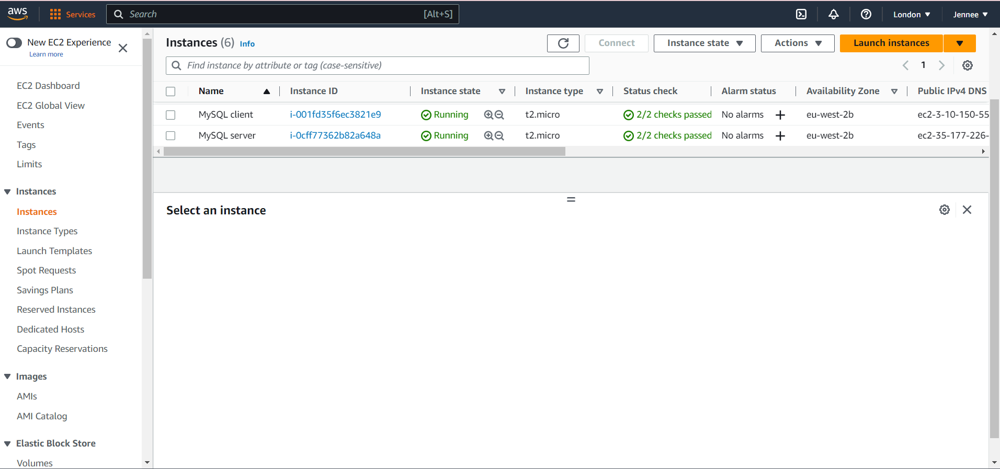

5. Then open a terminal on your system and enter the folder where your previously downloaded PEM file is located.

#### To learn how to download PEM File from AWS. Click [here](https://intellipaat.com/community/52119/how-to-download-a-pem-file-from-aws)

#### ***In this case we can use the Git Bash and Powershel Terminals***

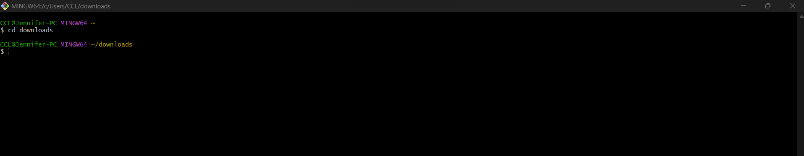

6. We connect to each of the 2 instances (mysql client and mysql server) from two seperate ubuntu terminal using the command: using this command for each:
>`ssh -i "Jennee-EC2.pem" ubuntu@ec2-35-176-8-236.eu-west-2.compute.amazonaws.com`
###### *Use you own*

 

#### This automatically connects to the instance.
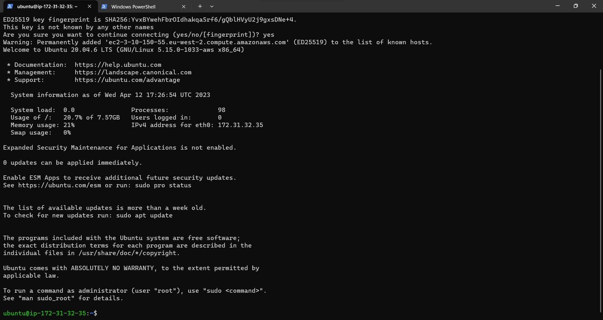

### *In this project, you need to onboard 20 new Linux users onto a server. We'll create a shell script that reads a **csv** file that contains the first name of the users to be onboarded.*

#### After connecting to the instances on each of the terminals, we edit the /etc/hostname/ file to change the names of each of the servers so as to align with the given name on the instance i.e **client** and **server** respectively. We do this using the command:
>`$ sudo su`

#### *To chnage to root user*, 
#### then

>`$ vim /etc/hostname`
#### *to open the file*
#### Next, delete the ip address and write the name you want it to be, in this case **client** or **server**

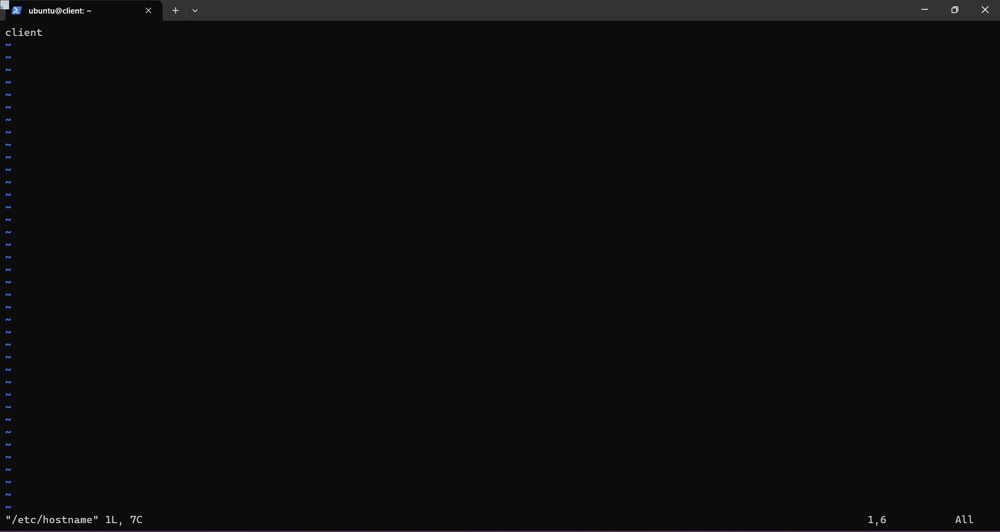

#### We press ESC :wq and ENTER to sav and exit the file.

We then run the commands on the client and server terminals respectively.

`hostname client` for the client

and

`hostname server` for the server

#### Run `exit` to exit the root, then `exit` agin to exit the instance.

 

#### Then log back into the instance for the effect to take place

#### *The 2 terminals should have hostnames like this*
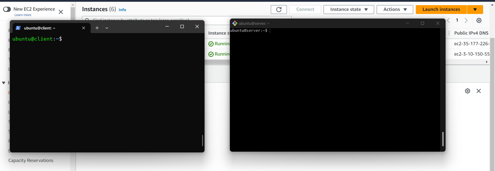

### Run this command on the **client** terminal:
>`sudo apt update`

### Run the same command on the **server** terminal

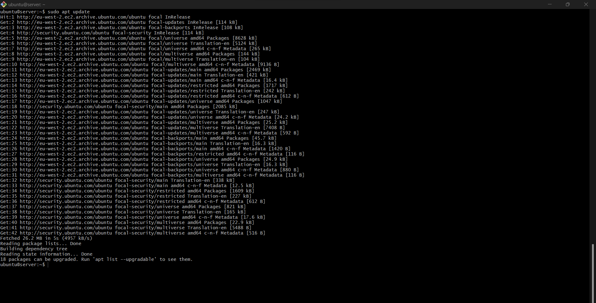

### Next, we install the mysql client on the **client**, using this command:
>`sudo apt install mysql-client`

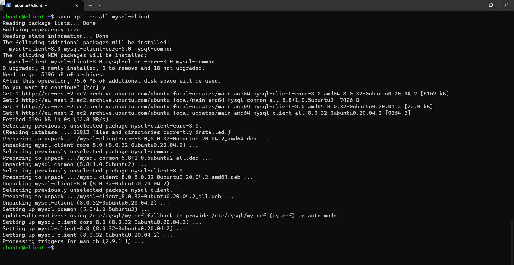

### Next, we install the mysql server on the **server**, using this command:
>`sudo apt install mysql-server`

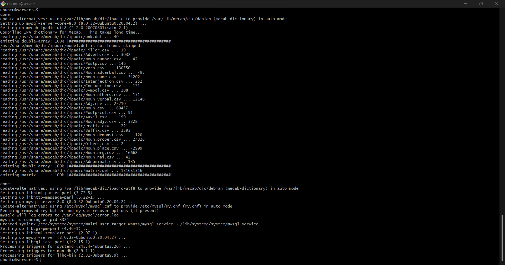

### Next, we verify the status of mysql by running the command on **server**:

>`sudo apt systemctl status mysql`

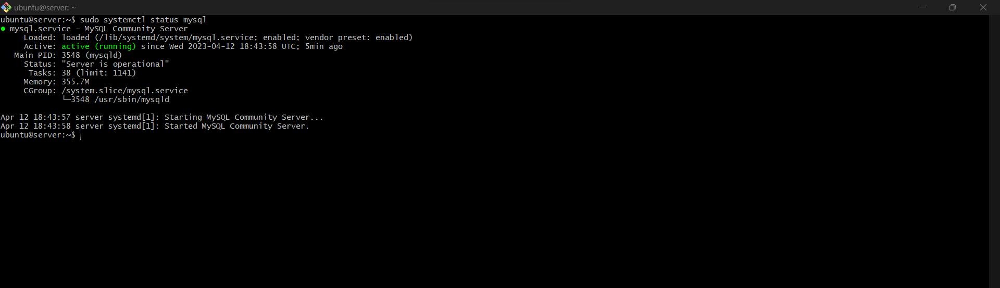

#### By default, both of the EC2 virtual servers are located in the same local virtual network, so they can communicate to each other using local IP addresses. 
#### Use ***mysql server***'s local IP address to connect from ***mysql client***. 

#### MySQL server uses TCP port 3306 by default, so you will have to open it by creating a new entry in **Inbound rules** in ***mysql server*** Security Groups. 
#### For extra security, do not allow all IP addresses to reach your ***mysql server*** – allow access only to the specific local IP address of your ***mysql client***.
 

### So, we navigate to the Edit Inbound Rules on teh Instance for ***MySQL server***
1. Add a new Rule
2. Under ***Type***, select **MYSQL/Aurora**
3. Get the IP address from the ***client*** terminal using this command:
>`ip addr show`
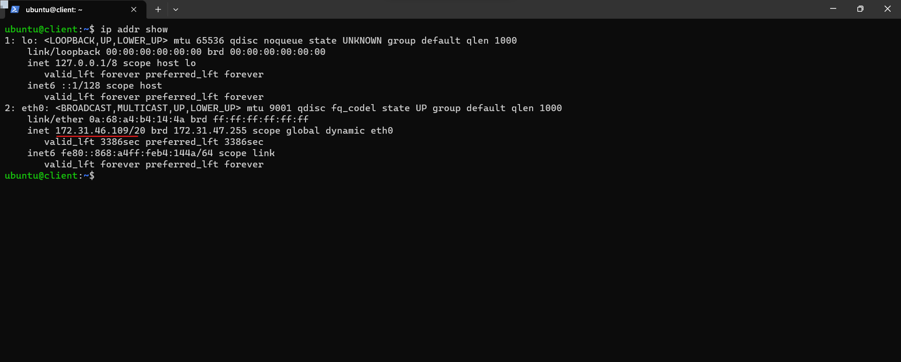

4. Save rules
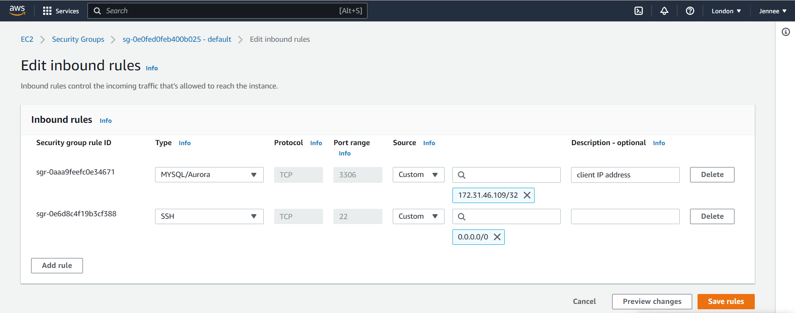

#### Next, we configure MySQL server to allow connections from remote hosts, using this command:

>`sudo vi /etc/mysql/mysql.conf.d/mysqld.cnf`

##### Replace ***127.0.0.1*** with ***0.0.0.0*** like this:
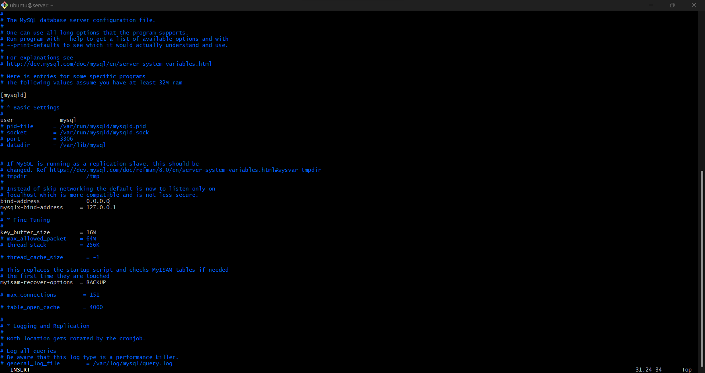

 

### To set up the mysql database in server that the client will be able to connect to, we run the following commands:

>`sudo mysql`

this lauches us into the mysql database.

Next we run the command:
>`ALTER USER 'root'@'localhost' IDENTIFIED WITH mysql_native_password BY 'PassWord.1';`

we `exit` mysql. 

#### Start the interactive script using this command:
>`sudo mysql_secure_installation`

#### At the prompt we put in the password we specified earlier i.e **PassWord.1** 
#### To create a validated password, type ***y***. 
#### Then choose the strength of the new password you want to create-at the prompt, we put in the new password.

#### Type ***y*** for the rest of the prompts to validate the changes.

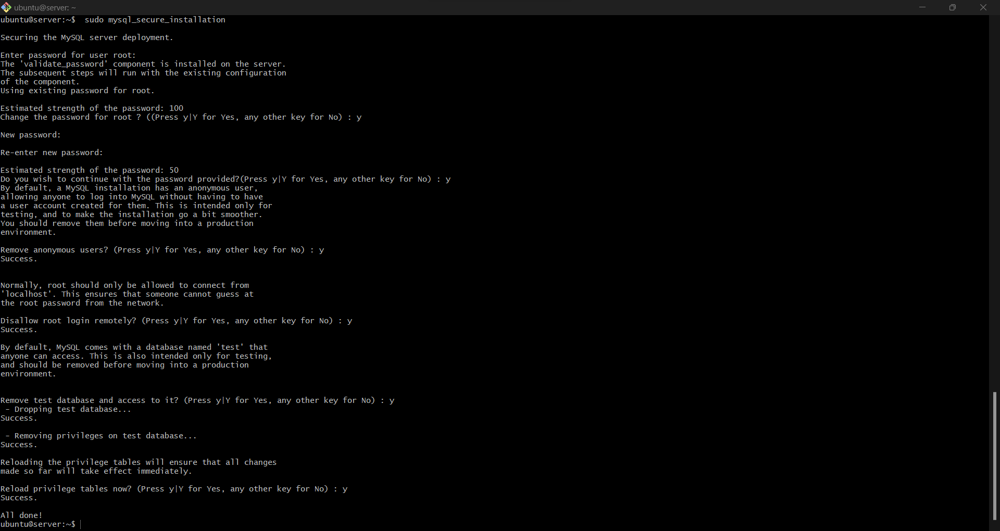

#### Then log in to the MySQL console using this command:
>`sudo mysql -p`

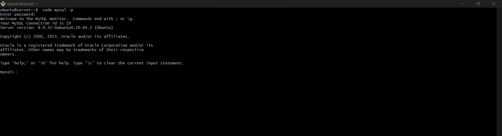

#### Then, create a new database, using the following command from the MySQL console:
`CREATE DATABASE 'example_databas';`

###### *Replace **example_database** with a name of your choice*

#### Next, Now you can create a new user and grant him full privileges on the database you have just created.

>` CREATE USER 'example_user'@'%' IDENTIFIED WITH mysql_native_password BY 'password';`
###### *Replace **example_user** with a username of your choice*
###### *Replace **password** with password of your choice*

 

#### We give this user permission over the 'example_database' database, using thi command:

>` GRANT ALL ON example_database.* TO 'solomon'@'%';`

Then, we `exit` the mysql shell.

#### To test if the new user has the proper permissions, log in to the MySQL console again, this time using the custom user credentials:

>`mysql -u example_user -p`

#### Enter password (that you just created for the user) when prompted.

#### Then run this command:
>`SHOW DATABASES;`

##### This will show the database we just created

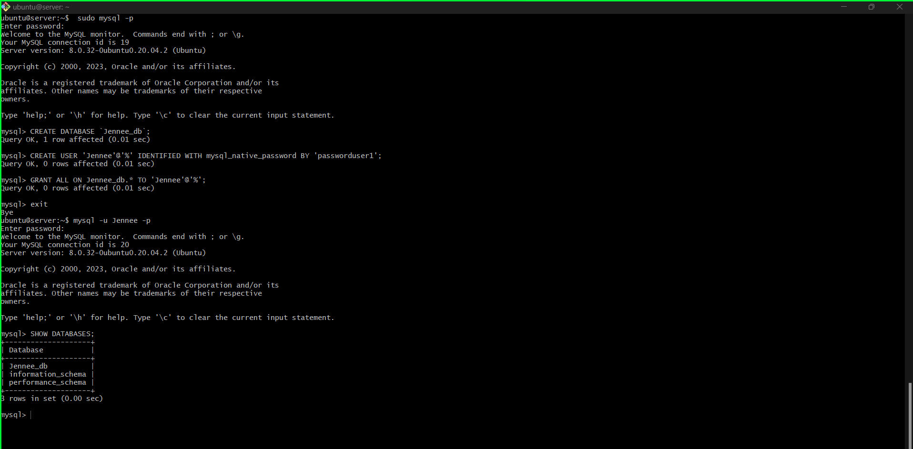

#### Then we go to our client instance terminal and connect to the mysql server database engine remotely without using the SSH.
#### We'll use the private IP address of the **mysql server** instance for this connection.

>`mysql -u example_user -h <IP-address> -p`

#### At the prompt we put in our password.

#### To check that we have successfully connected to a remote MySQL server and can perform SQL queries, run the command:

>`SHOW DATABASES;`

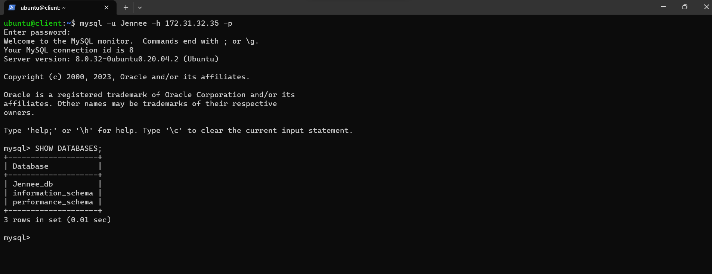

### If you see an output similar to the image above, then you have successfully deployed a fully functional MySQL Client-Server set up.